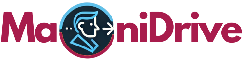

An E-commerce site template, implemented with [Next.js](https://nextjs.org/) and [TypeScript](https://www.typescriptlang.org/). Styled with [TailwindCSS](https://tailwindcss.com/). This is one of my portfolios, but I would be pleased if these codes helped others, so I published it as an open-source project. feel free to explore it, and if you need help, ask me. I would respond as soon as possible.

To support me, please create <strong>Pull request</strong> and give <strong>star⭐</strong> to this repository. 
   I appreciate your support in advance. ❤

&nbsp;
&nbsp;

[Technologies](#technologies) •
[Demo](#demo) •
[Features](#features) •
[Pages](#pages) •
[Getting started](#getting-started) •
[Contributing](#contributing) •
[Contact Me](#contact-me)
  

## 🔧Technologies
&nbsp;
&nbsp;
&nbsp;
&nbsp;

## ✨Demo
You can visit and explore in the Maoni template at (https://maonidrive.com/).